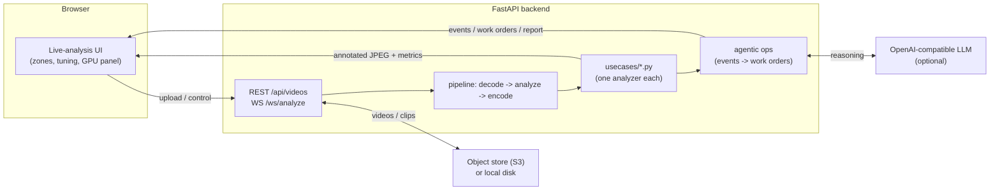

# CVLAB — Retail Computer-Vision Lab

A self-contained **computer-vision lab for retail / supermarket / grocery** use
cases. Upload a video (or connect a webcam or RTSP/HTTP stream), pick a use case,
and the backend streams **annotated video frames + live metrics** to your browser
in real time. An optional **agentic-ops layer** turns detections into work orders,
notifications, and a natural-language shift report using any OpenAI-compatible LLM.

It runs on a laptop with **one Docker command**, scales up to **Kubernetes with
GPU**, and is built to be **easy to read and extend** — every use case is a small,
self-contained Python file.

> Status: reference/demo project. Designed for learning, prototyping, and demos —
> not a turnkey production surveillance system.

---

## Table of contents

- [What it does](#what-it-does)
- [Screenshots](#screenshots)
- [Quick start (Docker)](#quick-start-docker)
- [Quick start (Python, no Docker)](#quick-start-python-no-docker)
- [How it works](#how-it-works)
- [Use cases](#use-cases)
- [Agentic ops (optional LLM)](#agentic-ops-optional-llm)
- [Repository layout](#repository-layout)
- [Documentation](#documentation)
- [Configuration](#configuration)
- [Deploying to Kubernetes](#deploying-to-kubernetes)
- [Tech stack](#tech-stack)
- [License](#license)
- [Security & privacy](#security--privacy)
- [Contributing](#contributing)

---

## What it does

- **Live analysis** — stream annotated frames over a WebSocket with per-use-case
  overlays (zones, boxes, tracks, heatmaps) and live metrics.
- **20 retail use cases** — shelf out-of-stock, queue/wait-time, traffic heatmaps,
  spill detection, and more (full list [below](#use-cases)).
- **Multiple sources** — saved video files, your **laptop camera**, or an
  **RTSP/HTTP (MJPEG) stream**.
- **Draw zones & tune** — draw regions of interest on the frame and adjust
  per-use-case parameters live; both persist per use case in your browser.
- **GPU aware** — runs on CPU; uses an NVIDIA GPU when available, with a live
  GPU-utilization panel.
- **Agentic ops (optional)** — detections become events → an LLM agent opens and
  resolves work orders, sends notifications, and writes a shift report. Falls back
  to deterministic logic when no LLM is configured, so demos never stall.
- **Use-case portal** — a static library site (`cv-portal/`) describing each use
  case, the models used, and why.

## Screenshots

| Live analysis | Use-case portal |
|---|---|
| live-analysis.png | portal.png |

## Quick start (Docker)

The fastest way — brings up the app plus a MinIO (S3-compatible) store:

```bash
cd cv-lab/deploy
docker compose up --build
# open http://localhost:8000
```

Then: pick a use case on the left, choose/upload a video at the bottom-left,
draw zones if the use case asks for them, and click **Start**.

## Quick start (Python, no Docker)

```bash
cd cv-lab/backend
python -m venv .venv
# Windows PowerShell: .venv\Scripts\Activate.ps1   |   macOS/Linux: source .venv/bin/activate
pip install -r requirements.txt

# Use local-disk storage (no S3 needed):
#   PowerShell:  $env:STORAGE_BACKEND="local"
#   bash:        export STORAGE_BACKEND=local
uvicorn app.main:app --reload --port 8000
# open http://localhost:8000
```

CPU works (slower). With an NVIDIA GPU + CUDA-enabled PyTorch, set `DEVICE=cuda:0`.

New to this? Read [docs/GETTING_STARTED.md](docs/GETTING_STARTED.md) for a
plain-language walkthrough and troubleshooting.

## How it works



Frames are decoded with OpenCV, run through the selected analyzer (YOLOv8 +
`supervision` trackers/zones, or lightweight OpenCV heuristics), re-encoded as
JPEG, and pushed to the browser over a WebSocket alongside a JSON metrics message.
See [docs/ARCHITECTURE.md](docs/ARCHITECTURE.md) for details.

## Use cases

| # | Use case | Pattern |
|---|---|---|
| 1 | Autonomous / Cashierless Checkout | people-tracking |
| 2 | Real-Time Shelf Out-of-Stock Detection | shelf-vision |
| 3 | Planogram Compliance Verification | shelf-vision |
| 4 | Shrink / Loss Prevention & Theft Detection | loss-prevention |
| 5 | Self-Checkout Fraud Detection | loss-prevention |
| 6 | Queue Length & Wait-Time Monitoring | people-tracking |
| 7 | Customer Traffic Heat Maps & Flow Analytics | people-tracking |
| 8 | Automated Product Expiry / Date Monitoring | shelf-vision |
| 9 | Smart Shopping Cart CV Integration | product-recognition |
| 10 | Produce Quality & Freshness Assessment | product-recognition |
| 11 | In-Store Aisle Scanning Robots | task-ops |
| 12 | Dynamic / Electronic Shelf Label Verification | shelf-vision |
| 13 | Staff Efficiency & Task Completion Monitoring | task-ops |
| 14 | Age Verification at Self-Checkout | privacy |
| 15 | Cold Chain / Refrigeration Door Compliance | task-ops |
| 16 | Spill & Hazard Detection | task-ops |
| 17 | Visual Product Search for Shoppers | product-recognition |
| 18 | Supply Chain & Receiving Dock Verification | product-recognition |
| 19 | Personalized In-Store Digital Signage | privacy |
| 20 | Dwell-Time / Product Engagement Analysis | people-tracking |

Details, camera framing, and model rationale per use case:
[docs/USE_CASES.md](docs/USE_CASES.md).

## Agentic ops (optional LLM)

When an LLM endpoint is configured, sustained detections become events that drive
an autonomous store-operations agent: it verifies via live metrics, opens a work
order, notifies the (mock) assignee, and resolves the order when the condition
clears. One click produces a manager **shift report**. With no LLM configured the
same flow runs on deterministic local logic, so it always works offline. See
[docs/AGENTIC_OPS.md](docs/AGENTIC_OPS.md).

## Repository layout

```
.
├── cv-lab/            # the application
│   ├── backend/       # FastAPI + CV pipeline + use-case analyzers
│   ├── frontend/      # live-analysis UI (vanilla HTML/CSS/JS)
│   └── deploy/        # docker-compose + Kubernetes manifests
├── cv-portal/         # static use-case library/portal site
├── docs/              # documentation (start here)
├── .env.example       # copy to cv-lab/backend/.env
└── LICENSE            # AGPL-3.0
```

## Documentation

- [Getting started](docs/GETTING_STARTED.md) — plain-language setup + troubleshooting
- [Architecture](docs/ARCHITECTURE.md) — components and data flow
- [Configuration](docs/CONFIGURATION.md) — every environment variable
- [Deployment](docs/DEPLOYMENT.md) — Docker, local, Kubernetes (CPU & GPU)
- [Use cases](docs/USE_CASES.md) — the 20 analyzers in detail
- [Agentic ops](docs/AGENTIC_OPS.md) — the optional LLM layer
- [Adding a use case](docs/ADDING_A_USE_CASE.md) — extend the pipeline
- [Glossary](docs/GLOSSARY.md) — jargon explained for all skill levels

## Configuration

Everything is configured with environment variables (or a `.env` file). The most
useful:

| Variable | Default | Purpose |
|---|---|---|
| `DEVICE` | `auto` | `auto` / `cpu` / `cuda:0` |
| `STORAGE_BACKEND` | `auto` | `auto` / `s3` / `local` |
| `NAI_BASE_URL` | _(blank)_ | OpenAI-compatible LLM endpoint (blank = disabled) |
| `TARGET_FPS` | `12` | Server-side stream throttle |

Full reference: [docs/CONFIGURATION.md](docs/CONFIGURATION.md). Copy
[.env.example](.env.example) to `cv-lab/backend/.env` to begin.

## Deploying to Kubernetes

Manifests live in `cv-lab/deploy/k8s/` with CPU and GPU variants and a
registry-free path (ship source via a ConfigMap). Full walkthrough:
[cv-lab/DEPLOYMENT.md](cv-lab/DEPLOYMENT.md).

## Tech stack

- **Backend:** FastAPI, Uvicorn, WebSockets
- **Computer vision:** Ultralytics YOLOv8, `supervision` (ByteTrack, zones,
  annotators), OpenCV, NumPy
- **Storage:** boto3 → any S3-compatible store (Nutanix Objects, MinIO, AWS S3),
  with a local-disk fallback
- **Frontend:** plain HTML/CSS/vanilla JS (no build step)
- **LLM (optional):** any OpenAI-compatible chat-completions endpoint

## License

This project is licensed under the **GNU Affero General Public License v3.0
(AGPL-3.0)** — see [LICENSE](LICENSE).

> **Why AGPL?** A core dependency, **Ultralytics YOLOv8, is AGPL-3.0**. Because
> this app serves the model over a network, AGPL's network-use clause applies:
> anyone who runs a modified version as a network service must offer the
> corresponding source. If you need different terms, you must replace the
> YOLOv8 dependency and/or obtain a commercial Ultralytics license. See
> [docs/CONFIGURATION.md](docs/CONFIGURATION.md) for swapping the detector.

Third-party components retain their own licenses.

## Security & privacy

- No secrets are committed; supply them via `.env` or Kubernetes Secrets.
- Report vulnerabilities per [SECURITY.md](SECURITY.md).
- The bundled use cases are privacy-preserving by design (anonymous
  detection/tracking; no facial recognition or biometric identification). Comply
  with the camera/CCTV-analytics laws in your jurisdiction.

## Contributing

Contributions welcome — see [CONTRIBUTING.md](CONTRIBUTING.md) and
[CODE_OF_CONDUCT.md](CODE_OF_CONDUCT.md). Adding a use case is intentionally easy:
[docs/ADDING_A_USE_CASE.md](docs/ADDING_A_USE_CASE.md).
