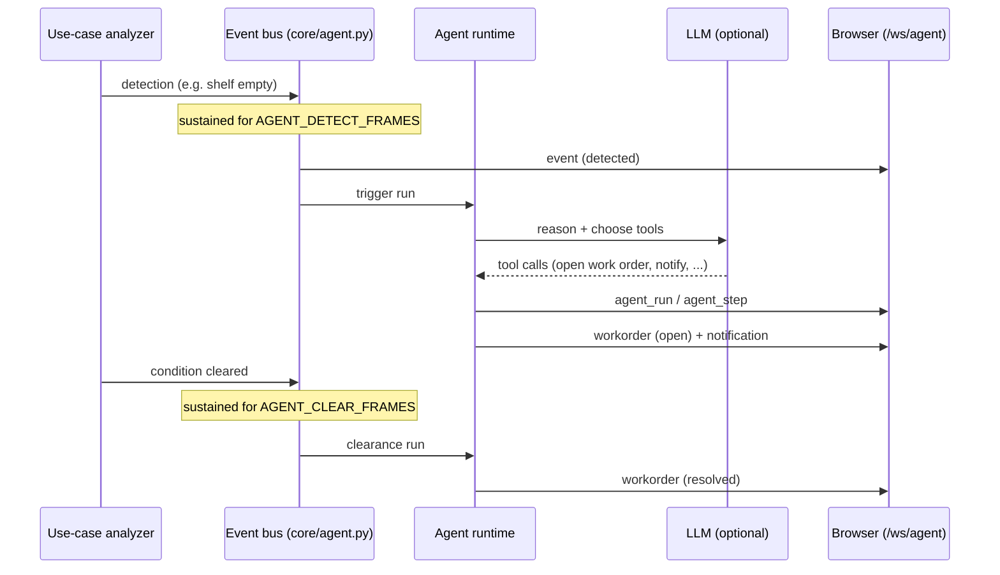

# Agentic ops

The agentic-ops layer turns raw detections into **store operations**: events,
autonomous agent runs, work orders, notifications, and a manager **shift
report**. It is optional — without an LLM it runs on deterministic local logic so
demos always work.

## The loop



## What you see in the UI

- **Event feed** — `detected` and `cleared` events with headlines.
- **Agent run** — step-by-step trace of the agent's reasoning and tool calls.
- **Work orders** — created with a priority and assignee, then resolved when the
  condition clears.
- **Notifications** — messages to the (mock) assignee.
- **Shift report** — a natural-language manager summary on demand.

## Enabling the LLM

Set an OpenAI-compatible endpoint (see [CONFIGURATION.md](CONFIGURATION.md)):

```bash
NAI_BASE_URL=https://your-llm-endpoint/v1
NAI_API_KEY=<key>
NAI_MODEL=<model-name>
```

Compatible backends include **Nutanix Enterprise AI (NAI)**, **vLLM**,
**Ollama** (OpenAI-compatible mode), and **OpenAI** itself. The client lives in
`core/llm.py` and uses the standard `/chat/completions` contract with tool
calls.

> The `NAI_*` variable names are historical; any OpenAI-compatible endpoint
> works.

## Without an LLM (fallback)

If `NAI_BASE_URL` is blank or the endpoint is unreachable/slow, the runtime uses
deterministic logic to open/resolve work orders and produces an "instant local
briefing" instead of the LLM-written report (capped by `REPORT_DEADLINE_S`). The
event → work-order → resolution chain still runs end to end.

## API endpoints

| Method | Path | Purpose |
|---|---|---|
| WS | `/ws/agent` | Live stream of events, agent steps, work orders, notifications |
| GET | `/api/agent/ping` | LLM connectivity check (`{"ok": true, ...}`) |
| POST | `/api/agent/report` | Generate the shift report |

## Tuning

| Variable | Effect |
|---|---|
| `AGENT_DETECT_FRAMES` | How long an alert must persist before an event fires |
| `AGENT_CLEAR_FRAMES` | How long the OK state must persist before clearance |
| `AGENT_MAX_STEPS` | Max tool-use steps per agent run |
| `STORE_NAME` | Store name used in events and reports |
| `REPORT_DEADLINE_S` | Time budget before falling back to the local briefing |

## Testing the full chain

```bash
cd cv-lab && python e2e_agent_test.py   # server must be running on :8000
```

This synthesizes a shelf video (stocked → emptied → restocked), runs UC-2, and
asserts the whole chain fires: detected event → agent run → work order →
notification → cleared event → resolved work order → shift report.
