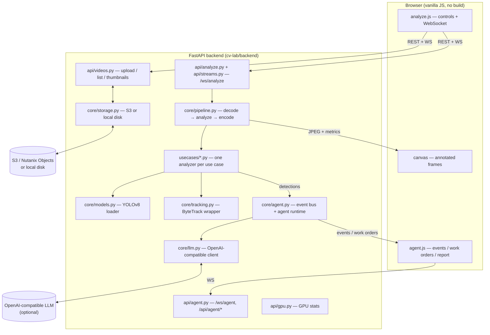

# Architecture

A high-level tour of how the system is put together. For a line-by-line
extension guide see [ADDING_A_USE_CASE.md](ADDING_A_USE_CASE.md).

## Components



## Backend layout

```
cv-lab/backend/app/
├── main.py            # FastAPI app; mounts routers + static frontend
├── config.py          # Settings (env-overridable)
├── schemas.py         # Pydantic models (AnalysisConfig, MetricEvent, ...)
├── api/
│   ├── videos.py      # upload / list / delete / thumbnail
│   ├── analyze.py     # /ws/analyze WebSocket (single view)
│   ├── streams.py     # multi-view streaming helpers
│   ├── agent.py       # /ws/agent + agent REST (ping, report)
│   └── gpu.py         # GPU utilization stats
├── core/
│   ├── pipeline.py    # frame loop: decode → analyze → JPEG encode
│   ├── models.py      # lazy YOLOv8 model loading + device selection
│   ├── tracking.py    # ByteTrack-based multi-object tracker
│   ├── agent.py       # event bus, work orders, agent runtime
│   ├── llm.py         # OpenAI-compatible chat-completions client
│   └── storage.py     # S3 (boto3) or local-disk backend
└── usecases/
    ├── base.py        # UseCaseAnalyzer ABC + registry + drawing helpers
    ├── common.py      # shared analyzer utilities
    └── ucNN_*.py      # the 20 analyzers
```

## Data flow (single analysis)

1. The browser uploads a video (`POST /api/videos`) or selects a saved one. The
   file is stored via `core/storage.py` (S3 or local disk).
2. The browser opens `ws://…/ws/analyze` and sends a `start` control message
   with an `AnalysisConfig` (use case id, source, zones, params).
3. `core/pipeline.py` opens the source with OpenCV, and for each frame:
   - runs the selected `UseCaseAnalyzer.process_frame()`,
   - throttles to `TARGET_FPS`, downscales to `MAX_STREAM_WIDTH`,
   - encodes the annotated frame as JPEG.
4. The server pushes each JPEG (binary) followed by a JSON `MetricEvent`.
5. The analyzer may emit **detections** to the agent event bus.

## The use-case plug-in pattern

Every use case subclasses `UseCaseAnalyzer` and registers itself with the
`@register` decorator. Importing `app.usecases` imports all `ucNN_*` modules,
each of which registers its class. `GET /api/usecases` then lists them and the UI
renders them automatically. Adding a file is all it takes — see
[ADDING_A_USE_CASE.md](ADDING_A_USE_CASE.md).

```python
@register
class QueueAnalyzer(UseCaseAnalyzer):
    id = "uc-06"
    title = "Queue Length & Wait-Time Monitoring"
    pattern = "people-tracking"
    needs_zones = True

    def setup(self, frame, config): ...
    def process_frame(self, frame, timestamp_s) -> tuple[np.ndarray, dict]: ...
```

## Computer-vision building blocks

- **Detection:** Ultralytics **YOLOv8** (COCO weights; person class for
  people-tracking use cases). Optional custom `.pt` models for shelf/spill.
- **Tracking:** `supervision` **ByteTrack** wrapper (`core/tracking.py`) gives
  stable IDs and dwell times.
- **Zones & annotation:** `supervision` `PolygonZone` + annotators, plus brand
  drawing helpers in `usecases/base.py`.
- **Heuristics:** some use cases (e.g. spill, out-of-stock) combine YOLO with
  lightweight OpenCV image analysis.

## Agentic-ops layer

`core/agent.py` subscribes to the detection event bus. When an alert condition
is sustained for `AGENT_DETECT_FRAMES`, it emits an **event**, runs an agent
(LLM tool-use loop via `core/llm.py`, or deterministic fallback), opens a **work
order**, and sends a **notification**. When the condition clears for
`AGENT_CLEAR_FRAMES`, it resolves the order. `POST /api/agent/report` produces a
manager shift report. Full detail: [AGENTIC_OPS.md](AGENTIC_OPS.md).

## Frontend

Plain HTML/CSS/vanilla JS served by FastAPI as static files (no build step). The
WebSocket client renders binary JPEG frames to a `<canvas>` and updates metric
panels from the JSON messages. Zones and tuning are persisted per use case in
`localStorage`.

## Storage backends

`core/storage.py` selects a backend from `STORAGE_BACKEND`:

- `s3` — any S3-compatible store via boto3 (Nutanix Objects, MinIO, AWS S3).
- `local` — local disk under `LOCAL_STORAGE_DIR` (simplest; no dependencies).
- `auto` — try S3, fall back to local if unreachable.
