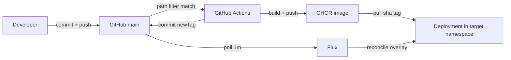

# GitOps delivery: GitHub → GHCR → Flux → Kubernetes

This document describes the **intended delivery path** for the CV Lab
live-analysis app. It is written for two readers at once:

- **People** can read the short summaries and diagrams and understand the
  system without Kubernetes jargon.
- **Agents** can copy the file layout, object names, and steps to build a
  similar pipeline for another application.

If you are an agent replicating this pattern, start at
[Replication checklist](#replication-checklist). Do not apply
`cv-lab/deploy/k8s/`. That folder is an older lab method. The live path is
`deploy/gitops/` plus `.github/workflows/publish-cvlab.yml` plus
`deploy/flux/`.

---

## What this system does, in one paragraph

A developer commits application code and pushes it to GitHub on the `main`
branch. GitHub Actions builds a container image and stores it in GitHub
Container Registry (GHCR). The same workflow then writes the **exact image
tag** into a Kubernetes overlay that lives in the same Git repo. Flux, running
on the target Kubernetes cluster, watches that repo. When the overlay
changes, Flux pulls the new image and updates the Deployment in a named
namespace, at the replica count written in Git. Workloads that must keep data
across pod restarts use PersistentVolumeClaims (PVCs). Workloads that do not
need durable data keep their files inside the image.

Nobody runs `kubectl apply` for day-to-day releases. Git is the desired
state. Flux makes the cluster match Git.

---

## Pieces to fill in per environment

Replace these when copying the pattern. Do not publish cluster IPs, node
addresses, or internal project names in public documentation.

| Piece | What to set |
| --- | --- |
| GitHub repo | This repository |
| Branch Flux tracks | `main` |
| Container registry | `ghcr.io` |
| Image | `ghcr.io/<org>/<repo>/cvlab` |
| Convenience tag | `main` (moves on every successful build) |
| Deployed tag | `sha-<full-git-commit>` (immutable, what Flux uses) |
| GitHub Actions workflow | `.github/workflows/publish-cvlab.yml` |
| Desired-state overlay | `deploy/gitops/<env>/` |
| Flux bootstrap objects | `deploy/flux/<env>-sync.yaml` |
| Namespace | The namespace named in that overlay |
| Deployment name | `cv-lab` |
| Replicas | Set in Git (`deployment.yaml`) |
| Service | ClusterIP, NodePort, or Ingress — set in Git |
| App PVC | None by default. Weights are in the image. Uploads use `emptyDir`. |
| Package visibility | Public GHCR package, **or** an out-of-band `imagePullSecret` |

---

## Picture of the path

```text
Developer laptop
      │  git commit
      │  git push origin main
      ▼
GitHub  (source of truth for code AND desired cluster state)
      │
      ├──────────────► GitHub Actions
      │                      │
      │                      ├─ docker build (linux/amd64)
      │                      ├─ docker push  ghcr.io/.../cvlab:sha-<commit>
      │                      ├─ docker push  ghcr.io/.../cvlab:main
      │                      └─ commit newTag into deploy/gitops/<env>/kustomization.yaml
      │                                      │
      │                                      ▼
      │                               GitHub main  (second commit: "Deploy cvlab sha-…")
      │                                      │
      ▼                                      ▼
Flux on the cluster  ◄──── polls Git every 1 minute ─┘
      │
      │  kubectl-equivalent: make cluster match overlay
      ▼
Target namespace
      │
      ├─ Deployment cv-lab
      │     image: ghcr.io/.../cvlab:sha-<commit>
      ├─ Service cv-lab
      ├─ ConfigMap cvlab-config
      └─ PVC only if a workload needs disks
```



Two Git commits per app change is normal:

1. **Your commit** — application code (and sometimes overlay YAML you edited).
2. **The bot commit** — GitHub Actions updates `newTag:` so Flux knows which
   image to run. Message shape: `Deploy cvlab sha-<full-commit>`.

If you only push and never see a `Deploy cvlab …` commit, the image was
built but the cluster will keep running the previous SHA.

---

## Roles: who owns which job

### GitHub

The Git repository is the only place that is allowed to describe:

- application source
- the Dockerfile
- the Kubernetes overlay (namespace, Deployment, Service, ConfigMap, PVCs)
- which image tag should be running (`newTag`)

Secrets that would let someone log into a system do **not** belong in Git.
LLM API keys, if used, are an out-of-band Secret. Registry credentials are
not committed either. Cluster IPs and internal project names do not belong
in public README or docs.

### GitHub Actions

A workflow on `ubuntu-latest` does four things, in order:

1. Check out the repo.
2. Log in to GHCR with `GITHUB_TOKEN`.
3. Build `linux/amd64` from `cv-lab/backend/Dockerfile` (context `cv-lab`) and
   push two tags.
4. On `main`, rewrite `newTag` in the GitOps overlay and push that change.

It also writes a provenance attestation for the image. Flux does not need it
to deploy.

The workflow is **not** a deploy tool. It never talks to the Kubernetes API.
It only publishes an image and updates Git.

### GHCR

GHCR stores the runnable bytes. Cluster nodes pull
`ghcr.io/<org>/<repo>/cvlab`.

If the package is public, the cluster does not need an `imagePullSecret`.
If you keep the package **private**, create a pull secret out of band and
reference it on the Deployment. Never commit the registry password.

### Flux

Flux must already be installed on the cluster. Two Flux objects, applied
**once**, connect this repo to the target namespace:

- `GitRepository` — "watch this Git URL, this branch, every minute"
- `Kustomization` — "build the overlay at this path and apply it into this
  namespace; delete objects that disappear from Git (`prune: true`)"

Flux is the only component that writes Kubernetes objects for this app after
bootstrap.

### The cluster

The overlay pins:

- namespace
- replica count
- resource requests and limits
- probes
- how the app is reached (NodePort, Ingress, or ClusterIP)
- volumes, if any

Changing replicas means editing `spec.replicas` in Git and letting Flux
reconcile. Do not `kubectl scale` and expect it to last: Flux will put the
replica count back to whatever Git says.

---

## End-to-end: one change, from commit to running pods

### 1. Change code locally

Typical files are under `cv-lab/backend/`, `cv-lab/frontend/`, or
`cv-lab/backend/Dockerfile`.

### 2. Commit

A local commit does **nothing** on GitHub, GHCR, or the cluster.

```bash
git add <files>
git commit -m "Short reason for the change."
```

### 3. Push to `main`

```bash
git push origin main
```

GitHub Actions starts only if **all** of these are true:

- the push is to `main` (or someone ran the workflow by hand)
- at least one changed path matches the workflow `on.push.paths` list

Path list today:

```text
cv-lab/backend/**
cv-lab/frontend/**
cv-lab/backend/Dockerfile
cv-lab/.dockerignore
.github/workflows/publish-cvlab.yml
```

A docs-only change does **not** rebuild the image. That is intentional. To
rebuild without an app change, use **Run workflow** on the Actions tab
(`workflow_dispatch`).

### 4. Actions builds and pushes the image

Image name:

```text
ghcr.io/${{ github.repository }}/cvlab
```

Tags written on a `main` build:

| Tag | Meaning |
| --- | --- |
| `main` | Moving pointer. Useful for humans. Not what Flux deploys. |
| `sha-<40-char-commit>` | Immutable. This is the tag written into GitOps. |

The Deployment YAML in Git still says `image: …/cvlab:main`. Kustomize
replaces that tag at apply time with `newTag`. Flux applies the
**substituted** manifest, so the running pods use the SHA tag.

Build platform is `linux/amd64` unless your nodes are a different
architecture.

The Dockerfile is a CPU Python image: OpenCV/ffmpeg, PyTorch CPU wheels,
YOLOv8n weights prefetched, process uid `1001`.

### 5. Actions updates the desired image tag in Git

On `main`, the last workflow step opens the overlay
`kustomization.yaml`, finds `newTag:`, and rewrites it to
`sha-<the-commit-that-was-just-built>`. Then it commits as
`github-actions[bot]` and pushes. The workflow needs
`permissions.contents: write` for that push.

If `newTag` is already that value, the step exits cleanly and does not
create an empty commit.

### 6. Flux notices Git changed

Example Flux objects (names and namespace are local to your cluster):

```yaml
apiVersion: source.toolkit.fluxcd.io/v1
kind: GitRepository
metadata:
  name: cvlab-retail
  namespace: <namespace>
spec:
  interval: 1m
  url: https://github.com/<org>/<repo>.git
  ref:
    branch: main
---
apiVersion: kustomize.toolkit.fluxcd.io/v1
kind: Kustomization
metadata:
  name: cvlab-retail
  namespace: <namespace>
spec:
  interval: 1m
  retryInterval: 30s
  timeout: 15m
  sourceRef:
    kind: GitRepository
    name: cvlab-retail
  path: ./deploy/gitops/<env>
  prune: true
  wait: true
  targetNamespace: <namespace>
```

The first image pull is large (CPU PyTorch + Ultralytics). A 15-minute
Kustomization timeout gives the node time to pull.

You can ask Flux to reconcile immediately instead of waiting up to a minute:

```bash
kubectl -n <namespace> annotate gitrepository cvlab-retail \
  reconcile.fluxcd.io/requestedAt="$(date +%s)" --overwrite
kubectl -n <namespace> annotate kustomization cvlab-retail \
  reconcile.fluxcd.io/requestedAt="$(date +%s)" --overwrite
```

### 7. The cluster runs the new pods

Flux applies:

| Object | File | What it is |
| --- | --- | --- |
| Namespace | `namespace.yaml` | Target namespace |
| ConfigMap | `configmap.yaml` | Non-secret env (`cvlab-config`) |
| Deployment | `deployment.yaml` | cv-lab pod(s) |
| Service | `service.yaml` | How the app is reached |
| Image pin | `kustomization.yaml` | `newTag` |

Health:

- container listens on `8000`
- startup, readiness, and liveness HTTP GET `/healthz`

Security (copy these unless you have a reason not to):

- non-root uid/gid `1001`
- read-only root filesystem
- all capabilities dropped
- `imagePullPolicy: Always`

Because the root filesystem is read-only, the pod still needs **scratch**
directories. Those are `emptyDir` volumes, not PVCs:

- `/tmp`
- `/app/.ultralytics`
- `/data` (uploaded videos; lost when the pod is replaced)

`emptyDir` dies with the pod. That is correct for cache and lab uploads. It
is wrong for a database.

---

## What Git owns vs what the cluster owns

| In Git (desired state) | Not in Git (out of band) |
| --- | --- |
| Overlay YAML | Flux controllers themselves (installed once) |
| Replica counts | GHCR login password (`GITHUB_TOKEN` is issued per job) |
| Image name + `newTag` | Optional LLM credential Secret |
| Non-secret ConfigMap values | Private-registry pull secrets, if you ever go private |
| Dockerfile and app source | Anything typed into a running pod |

If you edit a live Deployment with `kubectl edit`, Flux will overwrite it on
the next reconcile. Change Git instead.

---

## Persistent volumes: when to use a PVC

A PersistentVolumeClaim is a named disk request. Use a PVC only when **data
must survive** a pod delete, a node drain, or a rollout.

### This app does not use a PVC by default

YOLO weights are baked into the image. Uploads, Ultralytics cache, and `/tmp`
are `emptyDir`. A later PVC for uploads would need `strategy: Recreate` if
the StorageClass is `ReadWriteOnce` — that mode cannot roll with
`maxSurge: 1` while the old pod still holds the volume.

### Rule of thumb

| Need | Volume type |
| --- | --- |
| App code, static files, YOLO weights | Image layers |
| Temp files, Ultralytics cache, lab uploads | `emptyDir` |
| Database files, uploads a new pod must see | PVC |

---

## Overlay layout (copy this)

```text
deploy/
├── flux/
│   └── <env>-sync.yaml              # apply ONCE: GitRepository + Kustomization
└── gitops/
    └── <env>/                       # Flux path: ./deploy/gitops/<env>
        ├── kustomization.yaml       # namespace, labels, resources, images.newTag
        ├── namespace.yaml
        ├── configmap.yaml
        ├── deployment.yaml
        └── service.yaml
```

`kustomization.yaml` is the control file. Kustomize sets
`metadata.namespace` on every resource, so the individual YAML files do not
need a namespace field (except the Namespace object itself).

---

## GitHub Actions layout (copy this)

File: `.github/workflows/publish-cvlab.yml`

| Knob | This repo | Why |
| --- | --- | --- |
| `on.push.branches` | `[main]` | Only production branch builds |
| `on.push.paths` | backend, frontend, Dockerfile, dockerignore | Skip image builds for docs |
| `on.workflow_dispatch` | enabled | Manual rebuild |
| `permissions.contents` | `write` | Bot can push `newTag` |
| `permissions.packages` | `write` | Push to GHCR |
| `concurrency.group` | `publish-cvlab-${{ github.ref }}` | One build per branch |
| `cancel-in-progress` | `true` | A newer push cancels a stale build |
| `IMAGE_NAME` | `ghcr.io/${{ github.repository }}/cvlab` | One image per GitHub repo |
| `platforms` | `linux/amd64` | Match typical cluster nodes |

Required GitHub settings:

1. Actions enabled.
2. Workflow permission: read and write (so `GITHUB_TOKEN` can push to `main`
   and to GHCR).
3. GHCR package made **public**, or an `imagePullSecret` created on the
   cluster.
4. Branch protection: if `main` requires a PR, the bot push of `newTag`
   will fail unless you allow GitHub Actions to bypass.

---

## Bootstrap (once per cluster + repo)

Flux must already be installed. Then, **once**:

```bash
kubectl apply -f deploy/flux/<env>-sync.yaml
```

After that:

- Do **not** `kubectl apply -k deploy/gitops/<env>` for releases.
- Do **not** `kubectl apply -f cv-lab/deploy/k8s/`.
- Change Git, let Actions publish the image and `newTag`, let Flux deploy.

---

## How to verify a release

```bash
# Git: bot commit landed
git fetch origin
git log origin/main -5 --oneline

# Actions
gh run list --branch main --limit 3

# Flux
kubectl -n <namespace> get gitrepository,kustomization
kubectl -n <namespace> describe kustomization cvlab-retail

# Workload
kubectl -n <namespace> get deploy,po,svc
kubectl -n <namespace> get deploy cv-lab \
  -o jsonpath='{.spec.replicas} {.spec.template.spec.containers[0].image}{"\n"}'

# PVCs (none expected by default)
kubectl -n <namespace> get pvc

# HTTP (use your Service / Ingress / NodePort)
curl -sI http://<host>/
curl -s http://<host>/healthz
```

Healthy Flux Kustomization shows `Ready=True` and a revision matching the
Git commit that contains the current `newTag`.

Healthy Deployment shows Ready replicas and an image tag of `sha-` plus 40
hex characters, not a leftover `:main` that slipped past Kustomize.

---

## Replication checklist

### A. Git repo

- [ ] Application source and a `Dockerfile` that produces a linux/amd64 image.
- [ ] `.dockerignore` excludes `.git`, `.env*`, and any secret YAML.
- [ ] Overlay folder `deploy/gitops/<env>/` with Namespace,
      Deployment, Service, ConfigMap, `kustomization.yaml`.
- [ ] `images[].name` in Kustomize matches the image name in the
      Deployment (before tag rewrite).
- [ ] `spec.replicas` is set in Git, not by `kubectl scale`.
- [ ] Scratch dirs on a read-only root filesystem use `emptyDir`.
- [ ] Disk that must survive pods uses a PVC in the **same** overlay.
- [ ] Flux sync file `deploy/flux/<env>-sync.yaml` with
      `GitRepository` + `Kustomization`, `path` pointing at the overlay,
      `prune: true`.

### B. GitHub Actions

- [ ] Workflow on push to `main` with a path filter.
- [ ] `workflow_dispatch` for manual builds.
- [ ] Login to `ghcr.io` with `GITHUB_TOKEN`.
- [ ] Push `main` (or `latest`) **and** `sha-<full commit>`.
- [ ] Last step on `main` rewrites `newTag` and pushes.
- [ ] `contents: write` and `packages: write`.
- [ ] Concurrency group so two pushes do not interleave `newTag`.

### C. GHCR and cluster pull

- [ ] Package is public, **or** an `imagePullSecret` exists in the
      namespace and is set on the pod spec.
- [ ] Nodes can reach `ghcr.io`.

### D. Flux

- [ ] Flux controllers installed cluster-wide.
- [ ] Bootstrap YAML applied once into the app namespace.
- [ ] Poll interval is acceptable (this pattern: 1 minute).
- [ ] Overlay namespace matches `targetNamespace`.

### E. Day two

- [ ] Humans push to Git; they do not apply manifests.
- [ ] Replica changes, env changes, and PVC size changes go through Git.
- [ ] Image tag in Git is the SHA tag, not a floating tag.
- [ ] Docs-only commits are allowed to skip the image build.

---

## What not to do

- Do not `git commit` and expect the cluster to change. Push is required.
- Do not treat the `main` image tag as the cluster pin. Flux follows
  `newTag`.
- Do not apply `cv-lab/deploy/k8s/` into a Flux-managed namespace.
- Do not store API keys in the overlay ConfigMap.
- Do not publish cluster IPs, node addresses, or internal project names in
  public README or docs.
- Do not give a stateless or lab-demo UI a PVC "just in case."
- Do not run two replicas of a process that mounts a `ReadWriteOnce` PVC.
- Do not `kubectl scale` a Flux-managed Deployment.
- Do not skip `linux/amd64` when the cluster is amd64.
- Do not put `imagePullSecret` YAML with a real password in Git.

---

## Mapping the pattern to a new project

Replace the names; keep the shape.

| This pattern | Your app |
| --- | --- |
| this GitHub repo | GitHub repo name |
| `cvlab` | image suffix (`ghcr.io/<org>/<repo>/<name>`) |
| `<namespace>` | namespace |
| `cv-lab` | Deployment / Service name |
| replica count in Git | replica count in Git |
| Service in the overlay | NodePort, LoadBalancer, or Ingress |
| `deploy/gitops/<env>` | `deploy/gitops/<env>` |
| `publish-cvlab.yml` | `publish-<name>.yml` |
| no app PVC | add `<name>-pvc.yaml` only if data must persist |

The control loop never changes:

**Git commit → GitHub push → Actions image to GHCR → Actions writes SHA
into Git → Flux reads Git → the cluster runs that SHA at the replica count
in Git → PVC only for durable disks.**

---

## Related files in this repo

| File | Role |
| --- | --- |
| `.github/workflows/publish-cvlab.yml` | Build, push, update `newTag` |
| `cv-lab/backend/Dockerfile` | Image definition |
| `deploy/flux/<env>-sync.yaml` | One-time Flux bootstrap |
| `deploy/gitops/<env>/*` | Desired cluster state |
| `deploy/gitops/README.md` | Short operator notes |
| `cv-lab/deploy/k8s/*` | Legacy hand-apply manifests; not the GitOps path |

Short operator summary: [`deploy/gitops/README.md`](../deploy/gitops/README.md).
